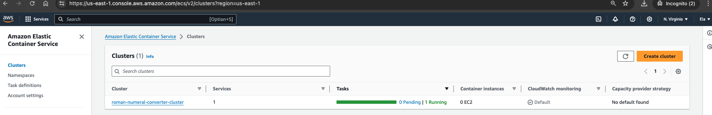

# roman-numeral-converter-aws
This is a Spring Boot Application exposes a REST API to convert a given integer to its corresponding Roman Numeral which is running on AWS Fargate with CI/CD pipeline hosted on AWS CodePipeline

<!-- TOC -->
* [roman-numeral-converter-aws](#roman-numeral-converter-aws)
  * [Design Architecture](#design-architecture)
  * [AWS Services](#aws-services)
  * [Pre-requisite](#pre-requisite)
  * [AWS CodeBuild](#aws-codebuild)
  * [AWS CodeDeploy](#aws-codedeploy)
  * [AWS CodePipeline](#aws-codepipeline)
<!-- TOC -->

## Design Architecture

## AWS Services
1. ECR - Elastic Container Registry 
2. ECS - Fargate
3. Cloudwatch - For logs 
4. CodePipeline - CI/CD pipeline
5. CodeBuild - Build code and docker image
6. CodeDeploy - Deployment Service

## AWS CodeBuild

1. Create Repository in ECR

   

2. Setup Source Provider
>
> Create buildspec.yml in codebase. It will have different phases like 
> 
> 1.pre-build - login into ecr
> 
> 2.build - mvn clean install
> 
> 3.post-build - push the image into ECR
> 

3. Select CodeBuild in AWS Console - > Create Build Project -> Provide ProjectName -> 
 Add Source as your Github repository -> buildspec.yml file and connect your repository with Github Personal access Token and select other default options.

   

4. Start the Project build. You can monitor the build logs and phases details to verify the success run

   

5. Build Succeeded

   

6. Configure cloudwatch log group, while creating the project & you can monitor the logs using that

   

   

## AWS CodeDeploy

1. Create Cluster in ECS

   

2. Create task definition, by provideing ECR and its image URI and HealthCheck Configuration

   

3. Create service in the ECS cluster , by selecting LaunchType as FARGATE

   

4. See the task under service

   

5. Wait till the task becomes Healthy and get the ip address, to verify our application.

   

## AWS CodePipeline

1. Create CodePipeline, by selecting github as source. 

   
 
2. Whenever a new commit is pushed, the code pipeline will auto trigger the build and deploy steps in the pipeline

   